# Self-Driving Car Engineer Nanodegree

## Vehicle Detection and Tracking

### Project Goals

This Project is the fifth assignment of ***Udacity Self-Driving Car Nanodegree program. The goal of this project is to develop a pipeline to process a video stream to output an annotated video with detected vehicles on the road lane.

To achieve our goal we will follow these steps:-

1.  Extract features for the training set including color histogram, Histogram of oriented Gradients (HOG) and spatial histogram.
1. Train a Classifier
1. Implement a technique to extract vehicle images from the video frames using trained classifer 
1. Annotate video frames with bounded boxes enclosing classified vehicles.

---

### *Now I will detail how I addressed problems and solutions for this project*

### Training Data

Training data for the project is provided by Udacity and consits of 64X64 images of [Vehicles](https://s3.amazonaws.com/udacity-sdc/Vehicle_Tracking/vehicles.zip) and [Non Vehicles](https://s3.amazonaws.com/udacity-sdc/Vehicle_Tracking/non-vehicles.zip)

***Training data count:***

| Vehicles     | Non Vehicles |
|--------------|:------------:|
| 8792 | 8968 |
Images provided are scaled down but still consists sufficient information for training a classifier.

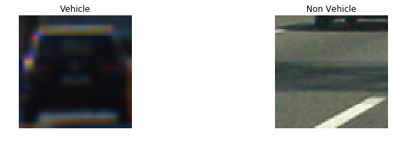
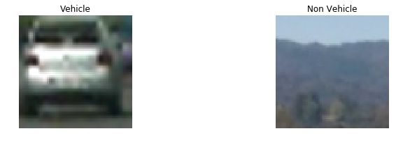
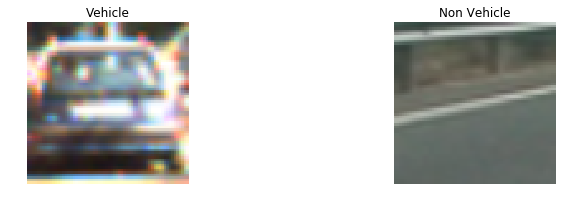

### Features

I tried using HSV, YUV but couldn't get desired results. Then I switched to **YCrCb** color channel for processing video frames and extracting following features for my training and testing data:-

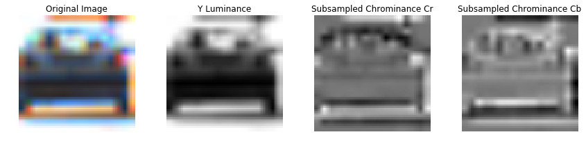
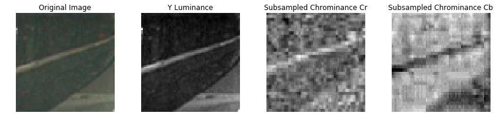


**1. Spatial Histogram**
Spatial histogram is computed for channels of images resizeing to 32X32

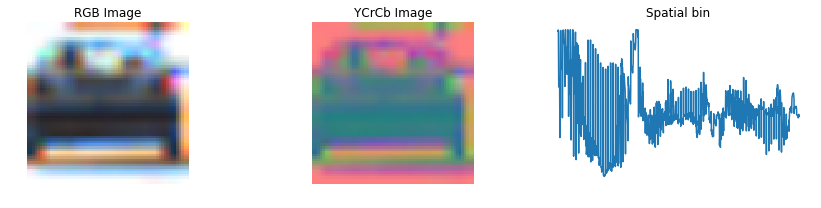
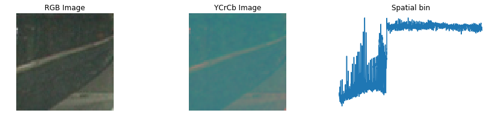
    
**2. Color Histogram**
Histogram of all three channels of YCrCb color channels of image with bin size of 32

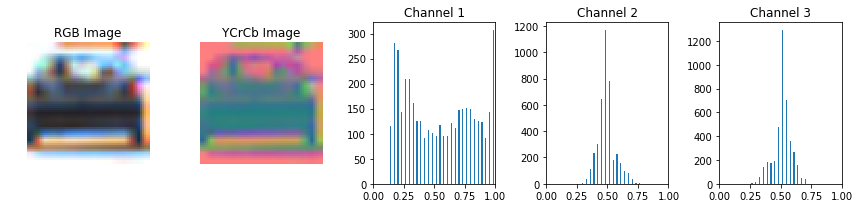
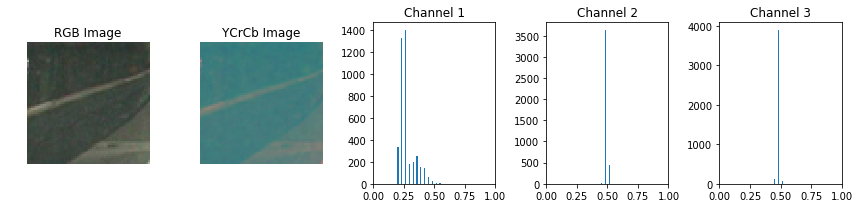


**3.  Histogram of Gradient (HOG)**
HOG being one of the most important feature and contributes maximum in classification of objects. After trying different combinations I finally used only single channel for computing HOG.

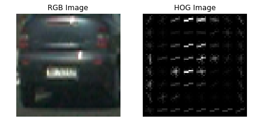
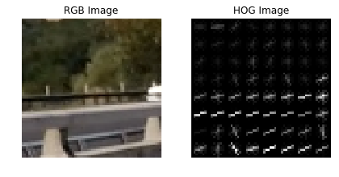

Parameters for HOG as well as for other features extractors were finetuned manually by try and error so that it optimizes accuracy. Following HOG parameters were finalzed:

|    Parameter    | Value |
|:---------------:|:-----:|
| Orientations    | 9     |
| Pixels per cell | 8     |
| Cells per block | 2     |
| Colorspace      | YCrCb |


Combination of mentioned features are sufficient enough for classifying vehicles in the given project.

For this project I ended up getting `Total features 4932`


### Classifier

Project required to build a classifier that is able to classify vehicles with in video frames.There are multiple classifiers to choose from. I have used SVC classifier with rbf kernel. I tried using Liner kernel as well but accuracy and results for Liner Kernel was not that great. 

Following paramters were used with SVC classifier:- kernel: rbf, C : 10

### Data prepration and training

Features extracted from given images is split into Training and Testing data using sklearn library in 80:20 ratio.

Then data is normalized using `StandardScaler` from `sklearn`

Once done model is trained against training data and then tested against remaining 20% of testing_data.

   Train accuracy :  1.0
   
   Test accuracy  :  ~.99
   
   
### Sliding Window Search (Vehicle detection)

***HOG Subsampling method approach was used as described in Udacity course material to detect vehicles. This approach is effective as compared with basic window search because it computes HOG only once for all windows.***

For this given image is split into multiple regions. Then features are extracted for the region and then entire region is iterated in a defined window size to detect vehicles using trained classifier. 

Regions where ever classifier detects presence of vehicles are hot encoded. 

This also leads to few ***False Positive*** regions where non vehicle gets classified as ***Vehicle***

To over come this ***Thresholding*** is applied where regions classified as vehicles by less than a configured count re removed so as to only retain high probability regions.

Another way of reducing false

```Python
def apply_threshold(heatmap, threshold):
    if len(heatmap) > 0 :
        heatmap[heatmap <= threshold] = 0
    return heatmap```


Thresholding helps in removing false positives by removing those hot encoded pixels where intensity is less than a configured value which is **1** in my case. This translates to removing predictions done only by 1 of the window by assuming less probability of its being an valid prediction.


Once hot encoding is thresholded, `Labels` are generated and then final bounded boxes are calculated.

These bounded boxes are then ploted on original images thereby bounding detected vehicles.

**Here are few snapshopts of different stages of image processing:**
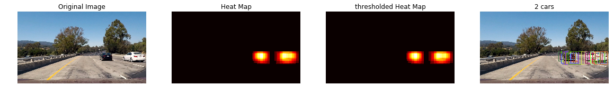
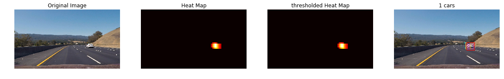
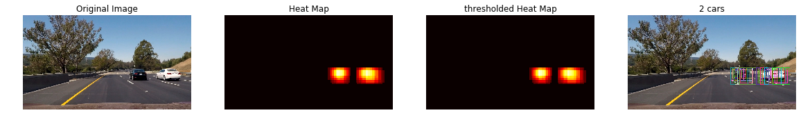


### Video Implementation


Here is the link to project video [Project Video](./project_video_out.mp4)


   
### Pipeline

Pipeline is the sequence of actions taken on frames extracted from video to detect and annotate vehicles. This pipeline is passed as an input to the VideoFileClip methods provided by *moviepy* library

```
from moviepy.editor import VideoFileClip
```

```
prj_video = 'project_video.mp4'
proj_out_file = 'project_video_out.mp4'
video_clip = VideoFileClip(prj_video)
video_clip_out = video_clip.fl_image(pipeline)
```
 
**My pipeline goes as follows:-**

1. Select multiple horizontal subsections from the image to process individually for vehicle detection.
2. Scale image subsections.
3. Extract features of the image subsections including all those were used during training model.
4. Using sliding window approach, extract feautres for each window and normalize them.
5. Using trained model predict vehicle and detect bounded coordinates.
6. Plot heatmap.
7. Average out heatmap.
8. Apply heatmap threshold
9. Derive labels.
10. Extract vehicle bounded boxes and plot on original image. 


### Discussion

1. One of the major problem I faced is hardware limitation. With given hardware SVC with rbf kernel takes long to train and validate. This additionally creats lot of problem when running project video on pipeline. 
    For me average time to process project video comes around 2.15 hours. This slowed the pace of development to a great extent. So as a general advice I will suggest others to use hardware with better CPU.

2. Second problem I faced is in using of LinearSVM classifier. Test accuracy of classifier comes around 98%. To improve the accuracy I tried augmenting the data and for that I flipped all the training/test images on verticle axis. Even despite adding this the accuracy didn't improve much and I continued getting quite a bit of false positives.
    Once I switched from LinerSVM to rbf Kernel, it impoved drastically.
    
3. Second problem that I faced was of bobbling effect across frames. Bounded box derived across frames at time don't go in continuity so the net effect is shaky-ness in video.
 To over come this I implemented HeatMap Averaging. What essentially I am doing is that I persist last N heat maps generated and then every time I need a heat map to generate labels, I use average of last N heatmaps. This averages out heat map co-ordinates and there for streamlines the video.
 
 Class responsible for maintaining and averaging heatmaps is Heatmap and its stucture goes like this:-
 
 ```
class Heatmap:    
    def __init__(self, threshold)
    def pushIn(self, heatmap)
    def __pushOut(self)
    def pullAvg(self)
  ```
  
  Pipeline code to perform heatmap averaging:-
  ```
   heatmap_img = add_heat(heatmap_img, flattened_box_list)
   avg_heat_map = heatmap.pushIn(heatmap_img)

  ```


